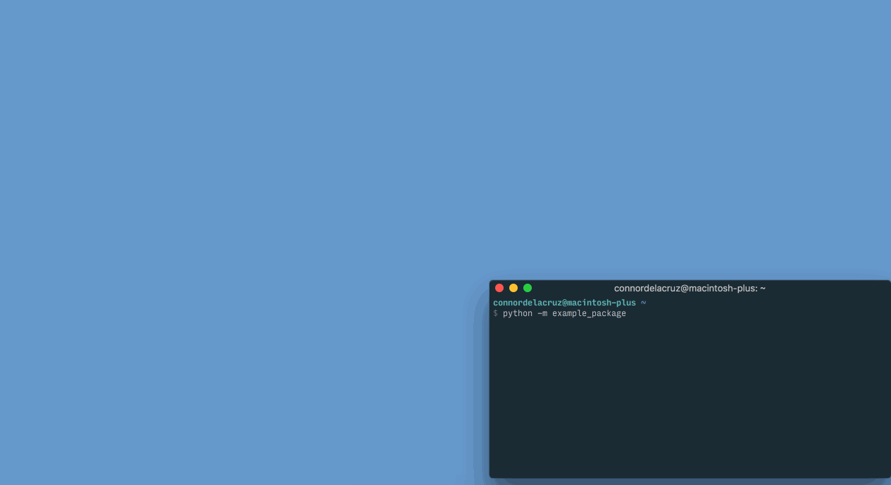

Example Project
===============

.. contents::

A quick example test project using ``webdriver_test_tools``. Source code for the example project can be found `here <https://github.com/connordelacruz/webdriver-test-tools/tree/master/docs/example/example-project>`__.

Initialize the project
----------------------

First, create a directory for the test project:

.. code-block:: none

    mkdir example-project
    cd example-project

Once in the project directory, run the following command to initialize the project:

.. code-block:: none

    webdriver_test_tools --init

You will be prompted to enter a name for the test project python package. To be a valid package name, it needs to only use alphanumeric characters and underscores and it cannot start with a number. For this example, we’ll call it ``example_package``. Initializing the project should create the following files and directories:

.. code-block:: none

    example-project/
    ├── README.rst
    ├── example_package/
    │   ├── __init__.py
    │   ├── __main__.py
    │   ├── config/
    │   │   ├── __init__.py
    │   │   ├── browser.py
    │   │   ├── browserstack.py
    │   │   ├── site.py
    │   │   ├── test.py
    │   │   └── webdriver.py
    │   ├── data/
    │   ├── log/
    │   ├── pages/
    │   ├── templates/
    │   │   ├── page_object.py
    │   │   └── test_case.py
    │   └── tests/
    │       └── __init__.py
    └── setup.py

After initializing the test project, run:

.. code-block:: none

    pip install -e .

Installing with the ``-e`` flag will update the package automatically when changes are made to the source code.

Configure site URLs
-------------------

After initializing a project, the URL of the site to be tested will need to be configured. In ``example_package/config/site.py``, set the ``SITE_URL`` and ``BASE_URL`` of the ``SiteConfig`` class.

For this example, we’ll use `example.com <https://www.example.com/>`__.

.. literalinclude:: ../example/example-project/example_package/config/site.py
    :caption: config/site.py:
    :lines: 1-12
    :emphasize-lines: 10-11

We’ll be testing that clicking a link takes us to an external page, so we’ll add another variable ``INFO_URL`` to ``SiteConfig``:

.. literalinclude:: ../example/example-project/example_package/config/site.py
    :caption: config/site.py:
    :lines: 1-
    :emphasize-lines: 13-14

Add a page object
-----------------

Creating a new page object module
~~~~~~~~~~~~~~~~~~~~~~~~~~~~~~~~~

This test framework is best used with the `Page Object Model <https://martinfowler.com/bliki/PageObject.html>`__. Interaction with the page should be handled by page objects to minimize the need to alter tests whenever the HTML is changed.

After configuring URLs, we’ll want to add a page object for the home
page of example.com. Copy the template file ``templates/page_object.py``
to the ``pages/`` directory and name the copied file ``home.py``:

.. code-block:: none

    cp example_package/templates/page_object.py example_package/pages/home.py

In ``pages/home.py``, rename the ``TemplatePage`` class to ``HomePage``.

Locating page elements
~~~~~~~~~~~~~~~~~~~~~~

For any element we need to locate, we’ll want to keep track of how to target it in the ``Locator`` subclass. Selenium WebDriver locators are tuples in the format ``(By.<selection type>, <selection string>)``, where ``<selection type>`` is one of the constants declared in ``selenium.webdriver.common.by.By`` and ``<selection string>`` is the string used to find the element.

Example.com is a pretty bare bones website, so these examples will be pretty contrived. We’ll add locators for the site heading and the ‘More information…’ link.

To locate the ‘More information…’ link, we’re going to select it by its link text. Add ``HEADING`` and ``INFO_LINK`` variables to the ``Locator`` subclass:

.. literalinclude:: ../example/example-project/example_package/pages/home.py
    :caption: pages/home.py:
    :lines: 6-13
    :emphasize-lines: 7-8

The utility function ``locate.by_element_text()`` returns an XPATH locator for elements with the specified text.

Interacting with page elements
~~~~~~~~~~~~~~~~~~~~~~~~~~~~~~

For our example tests, we’ll want to look at the heading text and click on the ‘More information…’ link. Add the following functions to the ``HomePage`` class:

.. literalinclude:: ../example/example-project/example_package/pages/home.py
    :caption: pages/home.py:
    :pyobject: HomePage
    :emphasize-lines: 12-14,16-18

The ``BasePage`` method ``self.find_element(locator)`` is shorthand for ``self.driver.find_element(*locator)``. 

Add a test
----------

Creating a new test module
~~~~~~~~~~~~~~~~~~~~~~~~~~

Now that we have a page object for interacting with example.com, we can write a test case. Copy the file ``templates/test_case.py`` to the ``tests/`` directory and name the copied file ``homepage.py``:

.. code-block:: none

    cp example_package/templates/test_case.py example_package/tests/homepage.py

Whenever a new test module is created, it needs to be imported in ``tests/__init__.py`` so the framework can detect it when loading tests.

.. literalinclude:: ../example/example-project/example_package/tests/__init__.py
    :caption: tests/__init__.py:
    :emphasize-lines: 2

In ``tests/homepage.py``, rename the ``TemplateTestCase`` class to ``HomePageTestCase``. Then import the ``HomePage`` class created in the previous step.

.. literalinclude:: ../example/example-project/example_package/tests/homepage.py
    :caption: tests/homepage.py:
    :lines: 1-12
    :emphasize-lines: 1,11-12

Adding test functions
~~~~~~~~~~~~~~~~~~~~~

We’re going to add 2 test functions:

1. Retrieve the heading text and assert that it says ‘Example Domain’
2. Click the ‘More information…’ link and assert that the URL matches ``SiteConfig.INFO_URL``

.. literalinclude:: ../example/example-project/example_package/tests/homepage.py
    :caption: tests/homepage.py:
    :lines: 11-
    :emphasize-lines: 9-13,15-20

**Note:** Test functions need to begin with the prefix ``test_`` in order for the python ``unittest`` library to recognize them as tests.

We should now have everything we need to run our test suite. To verify that the framework is able to detect the tests, run:

.. code-block:: none

    python -m example_package --list

This prints a list of test cases and their test methods in the package. The output should look like this:

.. code-block:: none

    HomePageTestCase:
       test_more_information_link
       test_page_heading

Run the tests
-------------

Running the test suite
~~~~~~~~~~~~~~~~~~~~~~

To run our test suite:

.. code-block:: none

    python -m example_package

This will generate new test case classes for Chrome and Firefox based on the test case classes we wrote and run them. If all tests pass, the output should look like this:

.. code-block:: none

    (Firefox) Really contrived example test case
        Test that the 'More information...' link goes to the correct URL ... ok
        Ensure that the page heading text is correct ... ok
    (Chrome) Really contrived example test case
        Test that the 'More information...' link goes to the correct URL ... ok
        Ensure that the page heading text is correct ... ok

    ----------------------------------------------------------------------
    Ran 4 tests in 15.436s

    OK

Optional command line arguments
~~~~~~~~~~~~~~~~~~~~~~~~~~~~~~~

Test packages can be run with various optional arguments to run a limited set of test cases instead of running the entire suite. To see a list of command line arguments, run:

.. code-block:: none

    python -m example_package --help

Running in a specific browser
^^^^^^^^^^^^^^^^^^^^^^^^^^^^^

If we just wanted to run the tests in a specific browser, we can use the ``--browser`` command line argument. For example, if we only wanted to run Firefox test cases:

.. code-block:: none

    python -m example_package --browser firefox

Running specific test modules
^^^^^^^^^^^^^^^^^^^^^^^^^^^^^

If we only want to run a specific test module, we can use the ``--module`` command line argument. For example, if we just wanted to run ``tests/homepage.py``:

.. code-block:: none

    python -m example_package --module homepage

Since we only have one test module in this example, this doesn’t do anything different than normal, but this can be useful in test projects with multiple test modules.

Running specific test cases or functions
^^^^^^^^^^^^^^^^^^^^^^^^^^^^^^^^^^^^^^^^

If we only want to run a specific test case or function within a test case, we can use the ``--test`` command line argument. For example, if we just wanted to run HomePageTestCase:

.. code-block:: none

    python -m example_package --test HomePageTestCase

Since we only have one test case class in this example, this doesn’t do anything different than normal, but this can be useful in test projects with multiple cases.

If we just wanted to run the ``test_more_information_link`` function:

.. code-block:: none

    python -m example_package --test HomePageTestCase.test_more_information_link
